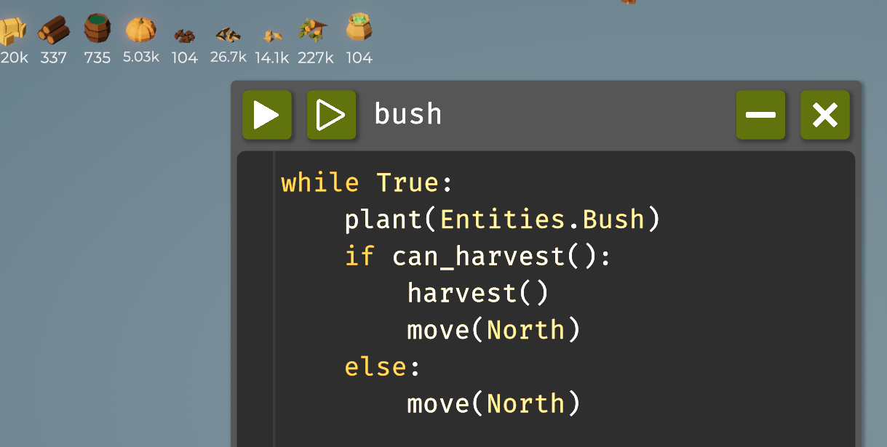
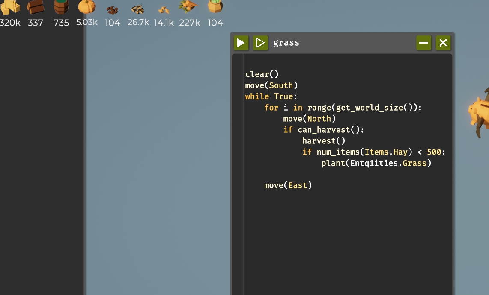
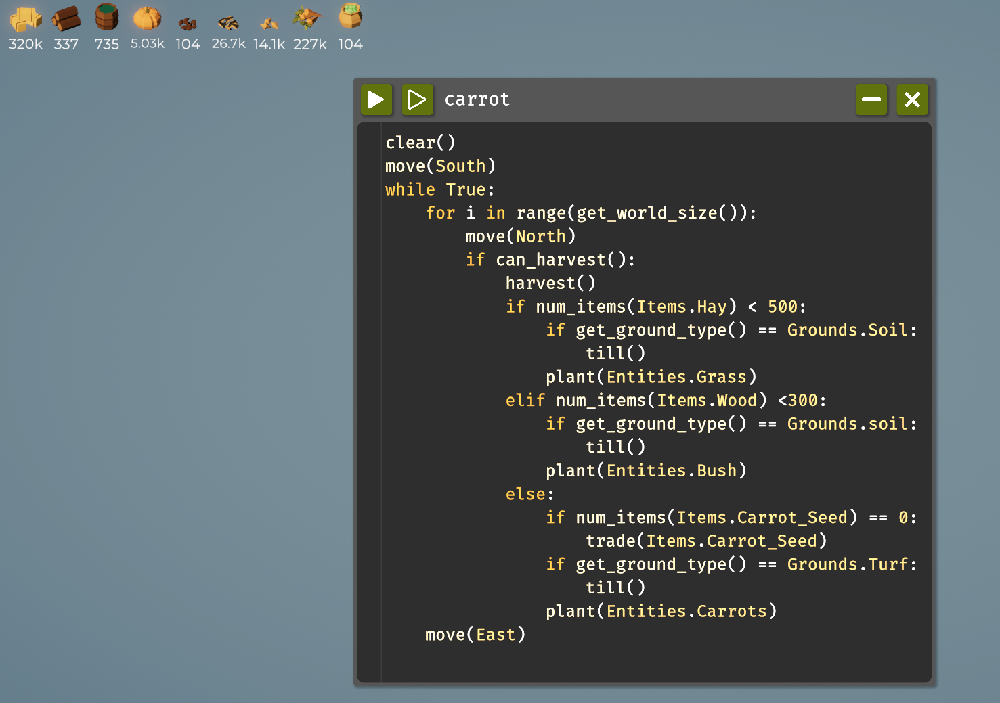
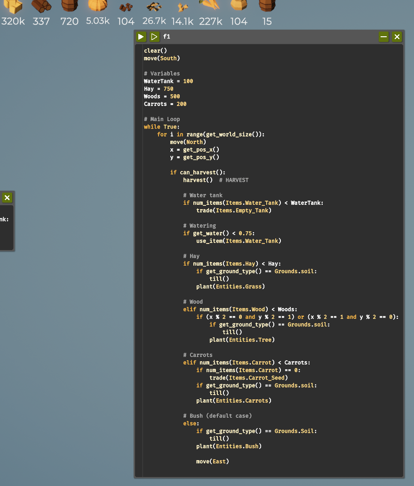
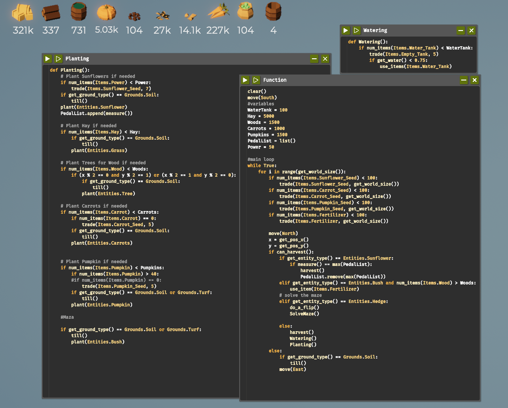
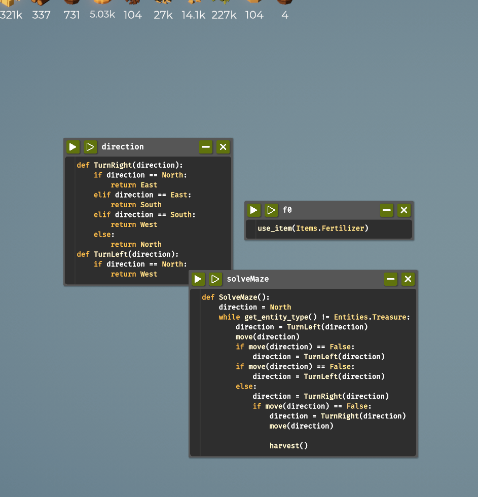

## Programming the Farming Drone (Report)

# Introduction
This project will be the programming of an autonomous framing drone designed to independently
generate resources. The main objective would be the gathering of grass, while also unlocking 
the different types of resources provided in the given environment. Essentially, this is a framing
game, but it is strategic and managerial since resources need to be managed and optimized by the
player.

# Table of Contents
- [Code Snippets and Explanation](#code-snippets-and-explanation)
- [Challenges and Learnings](#challenges-and-learnings)
- [References](#references)

# code-snippets-and-explanation
## Step1
***code***
```python
clear()
move(South)
while True:
	for i in range(get_world_size()):
		move(North)
		if can_harvest():
			harvest()
			if num_items(Items.Hay) < 500:
				plant(Entities.Grass)
```
# Explanation
Here, I am programming an agent to carry out a series of actions in a grid-like world. First, I located an agent at a starting point and moved it southward. I then ran an infinite loop, such that, through the grid, I implemented a cycle focused on vertical movements. I utilize a for loop in order to iterate over each cell in the height of the world, as specified by the method get_world_size(). I go north in every step, where each cell is scanned for anything that my agent might use with the function can_harvest(); if there is, then the agent harvests it. If the total amount of hay the agent has collected is less than 500, on that spot the agent plants grass to maintain available resources. Having finished this vertical sweep, I turn the agent one step east to continue its reaping and sowing in the next column. This is the loop that ensures the agent will continuously work its way across the area, maintaining resources while planting grass each time the hay supply falls below 500.

# Demo!
Image Demo:
 

***Note***
-using this above code i can able to get enough hay to increase the speed of the drone and upgrade the the yeild of grass.
-These Features can unlocked too: 
plant(Entities.Bush)

## Step2
***code***
```python 
while True:
	plant(Entities.Bush)
	if can_harvest():
		harvest()
		move(North)
	else:
		move(North)
```
# explanation
It's a coding of a loop where I keep planting bushes, checking whether they are ready to harvest or not,
and head north. Here it goes: First off, I make a while True loop, which makes it run all the time until 
I make it stop. In the loop, I plant a bush with the command plant(Entities.Bush). Then I call an if with 
can_harvest(), in order to verify if there is anything to be harvested. If true-just in case there's a ready
to be harvested bush-I would execute harvesting by using the command harvest(), then I do a move to north using
move(North). In other words, in case there is nothing to harvest-can_harvest() is false-the code will skip the har-
vest() command and perform just a move(North). This continuously plants it, checks if there is a harvestable bush, 
and moves north for as long as it's running.

# Demo
Image demo:
\

***note***
- using this above code i was able to get enough bush
- These Features can unlocked too: 
num_items(), Operators like <,>,=.
(get_world_size)
num_items(Items.Hay) 
plant(Entities.Grass)
num_items(Items.Carrot_Seed)


## Step3
***code***
```python
clear()
move(South)
while True:
	for i in range(get_world_size()):
		move(North)
		if can_harvest():
			harvest()
			if num_items(Items.Hay) < 500:
				if get_ground_type() == Grounds.Soil:
					till()
				plant(Entities.Grass)
			elif num_items(Items.Wood) <300:
				if get_ground_type() == Grounds.soil:
					till()
				plant(Entities.Bush)
			else:
				if num_items(Items.Carrot_Seed) == 0:
					trade(Items.Carrot_Seed)
				if get_ground_type() == Grounds.Turf:
					till()
				plant(Entities.Carrots)
	move(East)
```

# Explanation
This would clear the area and then start to move south. I enter a "forever" loop in which I perform some repetitive tasks. First of all, the size of the world is checked, loop over it by moving north, each move check if I can harvest resources. If harvesting is possible, then I collect the resources. Then I check my inventory for the amount of items. If I have less than 500 units of hay, then ground type-if it is soil, till the ground and plant grass. If I have enough hay but fewer than 300 units of wood, I do the same: till the soil if necessary and plant a bush.

When both my hay and wood needs are satisfied, I then turn my attention to carrots. Without carrot seeds, I trade for them. If the ground is turf, I till and plant carrots on it. After all these checks and planting are done, I move east to start all over again in another area. This would give me a good resource-collecting while I keep targeted inventory goals.

# Demo
Image Demo:


***Notes***
-  Using the code above I was able to get enough hay and wood  to unlock the 3*3 tile and upgreade the spped of drone and yield of hay, and also I was able to get enough hay, wood and carrots to unlock 4*4 tiles, increased the speed of the drone, have unlocked variables, have unlocked trees, have unlocked watering and unloced Functions.
 - These features were unlocked too:
 get_water() 
 trade(Items.Empty_Tanl) 
 use_item(Items.Water_Tank)
 def functions

## Step4
***code***
```python
clear()
move(South)

# Variables
WaterTank = 100
Hay = 750
Woods = 500
Carrots = 200

# Main Loop
while True:
    for i in range(get_world_size()):
        move(North)
        x = get_pos_x()
        y = get_pos_y()
        
        if can_harvest():
            harvest()  # HARVEST
            
            # Water tank
            if num_items(Items.Water_Tank) < WaterTank:
                trade(Items.Empty_Tank)
            
            # Watering
            if get_water() < 0.75:
                use_item(Items.Water_Tank)
            
            # Hay
            if num_items(Items.Hay) < Hay:
                if get_ground_type() == Grounds.soil:
                    till()
                plant(Entities.Grass)
            
            # Wood
            elif num_items(Items.Wood) < Woods:
                if (x % 2 == 0 and y % 2 == 1) or (x % 2 == 1 and y % 2 == 0):
                    if get_ground_type() == Grounds.soil:
                        till() 
                    plant(Entities.Tree)
            
            # Carrots
            elif num_items(Items.Carrot) < Carrots:
                if num_items(Items.Carrot) == 0:
                    trade(Items.Carrot_Seed)
                if get_ground_type() == Grounds.soil:
                    till()
                plant(Entities.Carrots)
            
            # Bush 
            else:
                if get_ground_type() == Grounds.Soil:
                    till()
                plant(Entities.Bush)
        
                move(East)
```
# Explanation
Sample routine: in the pseudo-environment I create, and that is to be managed and optimized, I consider resources such as water, hay, wood, and carrots. The starting values considered are: 100 units of water in the tank, 750 units of hay, 500 units of wood, and 200 units of carrots. I then enter an infinite loop, constantly executing while I am maneuvering in the environment and acting on the basis of resource status and location.

The loop iterates in order through the world, moving north in each, querying my current position. If I can harvest resources at my current position, I harvest. Then, if my water tank contains less than desired, I trade an empty tank to fill it. If my water level falls below 75%, I use tank water to water the plants.

I plant based on the resource quantities, in priority order: First, if I have less than the target quantity of hay, I till the soil and plant grass to improve my hay stock. If the hay is adequate but the wood is below target, then using my current position coordinates, I go row-column, row-column, planting trees for wood if I'm on suitable soil.

If the wood is stocked and the carrots are below target, then I start preparing for planting carrots. If I have no carrot seeds, I trade to get them. When I have seeds, I till and plant carrots. Finally, when all of the primary resources are at the target level, I default to planting bushes if the ground is suitable for it.

At every harvest and planting, I move eastward to ensure exploration and a continued even flow of resources across diverse areas. A structure like this will ensure that resource management is optimized at an appropriate action for every need of the subject to maintain a balance in the stock of essential items.

# Demo 
Image Demo:


***Note***
-In all, the code has enabled the abilities to harvest resources, control movements, manage water supplies, prepare the ground, plant specific resources in targeted places, and trade for supplies. These unlocked features altogether enable the code to function within the simulated environment as a fully autonomous resource management system.
- These features were unlocked too:
-  These features were unlocked too:
 measure() , trade(Items.Carrot_Seed), trade(Items.Pumpkin_Seed), trade(Items.sunflower_Seed), 


## step5
***Code***
```python
##Planting
def Planting():
    # Plant Sunflowers if needed
    if num_items(Items.Power) < Power:
        trade(Items.Sunflower_Seed, 7)
    if get_ground_type() == Grounds.Soil:
        till()
    plant(Entities.Sunflower)
    PedalList.append(measure())
    
    # Plant Hay if needed
    if num_items(Items.Hay) < Hay:
        if get_ground_type() == Grounds.Soil:
            till()
        plant(Entities.Grass)
    
    # Plant Trees for Wood if needed
    if num_items(Items.Wood) < Woods:
        if (x % 2 == 0 and y % 2 == 1) or (x % 2 == 1 and y % 2 == 0):
            if get_ground_type() == Grounds.Soil:
                till()
            plant(Entities.Tree)
    
    # Plant Carrots if needed
    if num_items(Items.Carrot) < Carrots:
        if num_items(Items.Carrot) == 0:
            trade(Items.Carrot_Seed, 5)
        if get_ground_type() == Grounds.Soil:
            till()
        plant(Entities.Carrots)
        
    
    # Plant Pumpkin if needed
    if num_items(Items.Pumpkin) < Pumpkins:
        if num_items(Items.Pumpkin) > 40:
        #if num_items(Items.Pumpkin) == 0:
            trade(Items.Pumpkin_Seed, 5)
        if get_ground_type() == Grounds.Soil or Grounds.Turf:
            till()
        plant(Entities.Pumpkin)
        
    #Maza
    
    if get_ground_type() == Grounds.Soil or Grounds.Turf:
        till()
        plant(Entities.Bush)

##Watering 
def Watering():
	if num_items(Items.Water_Tank) < WaterTank:
		trade(Items.Empty_Tank, 5)
		if get_water() < 0.75:
			use_items(Items.Water_Tank)
##function
clear()
move(South)
#variables
WaterTank = 100
Hay = 5000
Woods = 1500
Carrots = 1000
Pumpkins = 1500
PedalList = list()
Power = 50

#main loop
while True:
	for i in range(get_world_size()):
		if num_items(Items.Sunflower_Seed) < 100:
			trade(Items.Sunflower_Seed, get_world_size())
		if num_items(Items.Carrot_Seed) < 100:
			trade(Items.Carrot_Seed, get_world_size())
		if num_items(Items.Pumpkin_Seed) < 100:
			trade(Items.Pumpkin_Seed, get_world_size())
		if num_items(Items.Fertilizer) < 100:
			trade(Items.Fertilizer, get_world_size())
			
		move(North)
		x = get_pos_x()
		y = get_pos_y()
		if can_harvest():
			if get_entity_type() == Entities.Sunflower:
				if measure() == max(PedalList):
					harvest()
					PedalList.remove(max(PedalList))
			elif get_entity_type() == Entities.Bush and num_items(Items.Wood) > Woods:
				use_item(Items.Fertilizer)
			# solve the maze
			elif get_entity_type() == Entities.Hedge:
				do_a_flip()
				SolveMaze()
					
			else:
				harvest()
				Watering()
				Planting()
        else:
            if get_ground_type() == Grounds.Soil:
                till()
            move(East)
```

#Explanation
This code appears to be from a game or simulation where I have automated farming tasks. Major divisions for planting, watering, and the general function loop.
Under Planting, I make the planting of different crops and resources like sunflowers, hay, trees, carrots, and pumpkins. Each crop has its own conditions: for example, if I have fewer sunflowers than some threshold, I will plant them by trading for the seeds, then checking the ground type to see if it is soil, tilling if necessary, and then planting. This logic repeats for each crop, with some variation depending on the specific condition, such as proximity to other entities or items available.

In the Watering function, I make sure my water tank is full when it is low. If my water is below a threshold, then I do a trade of an empty tank for a filled one and use it on crops willy-nilly.

This code puts my main loop and initialization within the function section. I set the initial values here for resources such as water, hay, and wood. It iterates through each grid in the world, checks whether I need more of some particular seed or fertilizer, and trades for it. While cycling over the grid, it checks whether an entity detected is either a sunflower, pumpkin, or hedge, then reacts accordingly with harvest, fertilizer, solve maze, or water accordingly.

# Demo
Image Demo:


***Notes***
- Using the code above I was able to unlock Lists , Fertilizer , Polyculture, and Dictionaries also get_companion(), [Entities.Carrots, 3, 5], Entities.Grass , Entities.Bush, Entities.Carrots, and Entities.Tree
- These features were unlocked too: eitem(Items.Fertilizer), trade(Items.Fertilizer), get_entity_type() , Entities.Treasure, Entities.Hedge.

### Step6
***code***
```python
#SolveMaze
def SolveMaze():
	direction = North
	while get_entity_type() != Entities.Treasure:
		direction = TurnLeft(direction)
		move(direction)
		if move(direction) == False:
			direction = TurnLeft(direction)
		if move(direction) == False:
			direction = TurnLeft(direction)
		else:
			direction = TurnRight(direction)
			if move(direction) == False:
				direction = TurnRight(direction)
				move(direction)
		
				harvest()
# Direction
def TurnRight(direction):
	if direction == North:
		return East
	elif direction == East:
		return South
	elif direction == South:
		return West
	else:
		return North
def TurnLeft(direction):
	if direction == North:
		return West

#fertilizer function
use_item(Items.Fertilizer)

```

# Explanation
The code I have here is three major functions: TurnRight, TurnLeft, and SolveMaze, each for some certain purpose it will serve.

The function TurnRight and TurnLeft interpret the new direction based on my current direction. If I'm headed North and I turn right, I should be facing East now. The logic is simple; there are four conditions that handle all four possible directions that I can be in, namely North, East, South, and West. TurnRight cycles clockwise like this: North → East → South → West → North. TurnLeft cycles counterclockwise like this: North → West → South → East → North.

The SolveMaze function is a bit more complicated; it's actually the maze-solving algorithm that moves me in the direction I am facing while searching for an entity of type Treasure. Facing North initially, I keep navigating while I don't find the treasure. In case of an obstacle-detection-move(direction) == False-the direction is changed by turning left and if this is impossible then I turn again:. If I find an open path, I go that way. Eventually, after the treasure has been found, I call harvest() to collect it.

The tiny function, f0, is completely isolated; it merely calls the fertilizer function, use_item(Items.Fertilizer). As it has nothing to do with the functions that are solving the maze, perhaps it's intended to be part of another process or action in how I structure the code.

# Demo
Image Demo:


***Notes***
I was able to find the exit of the maze and the treasure inside. The SolveMaze function and the required functions that handle the direction, namely TurnRight and TurnLeft, allowed me to traverse through the maze and change directions when an obstacle blocked my path. This method eventually took me to the location where the treasure was located, which I was able to harvest and thus complete the objective and unlock the reward.

## challenges-and-learnings

# challenges 
- During my journey of playing, I went through lots of hustles to complete the game: first, I did not even know how to download the game since it was the first time that I came across it. When I started, I found the resources provided hard to understand, and I struggled for about an hour trying to make sense of things, especially since I don't consider myself a programmer or coder. While I have unlocked some tools, such as lists, I am still missing those higher-order powers like benchmarks, debug tools, or dictionaries that would help me estimate whether there is an even more efficient way of doing it. However, after a glimpse at some solutions online, I did get further along.

# Learning
- I have learned many important things from this game, such as the way to approach problem-solving and resiliency. The substitution of an integral character, the farmer, brought about changes that were quite unforeseen and took much creativity to find my way out. Besides, learning to move ahead despite changes and difficulties taught me resiliency. Extra difficulty without a farmer challenged my resolve and helped me grow as a player.

## references
1. Youtube:https://www.youtube.com/@OlexaYT
2. Youtube:https://youtu.be/JgsFGppJtsc?list=PLateWiNrGEtoIy8aeWse6dQOCToetjXJg


